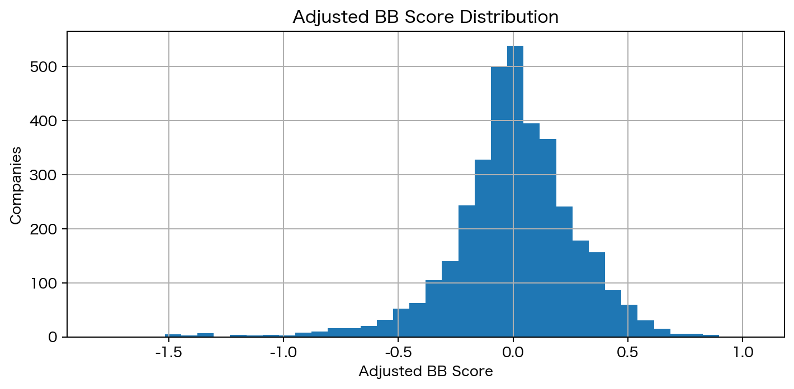
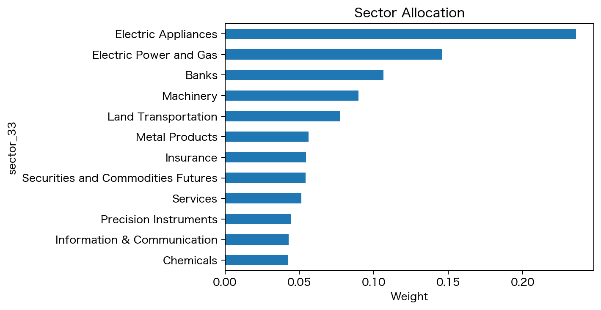
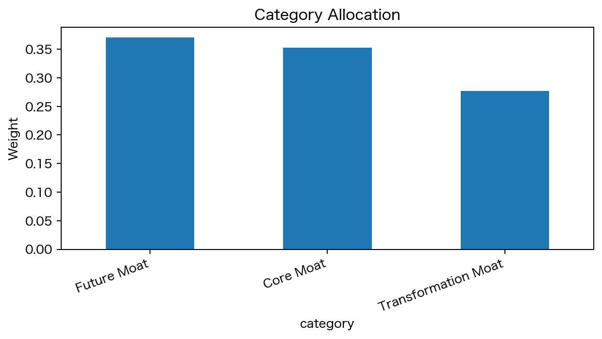
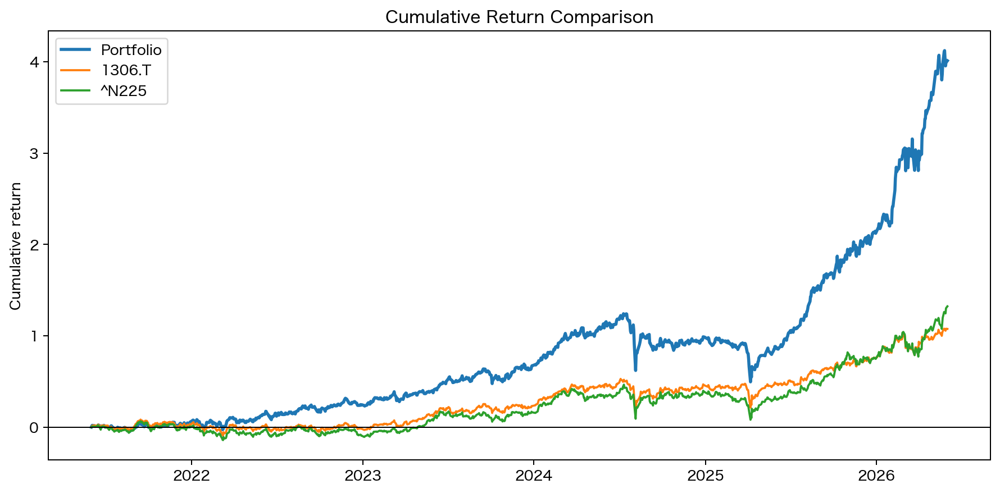
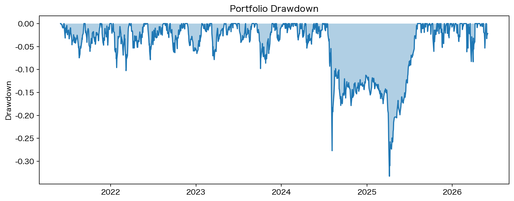
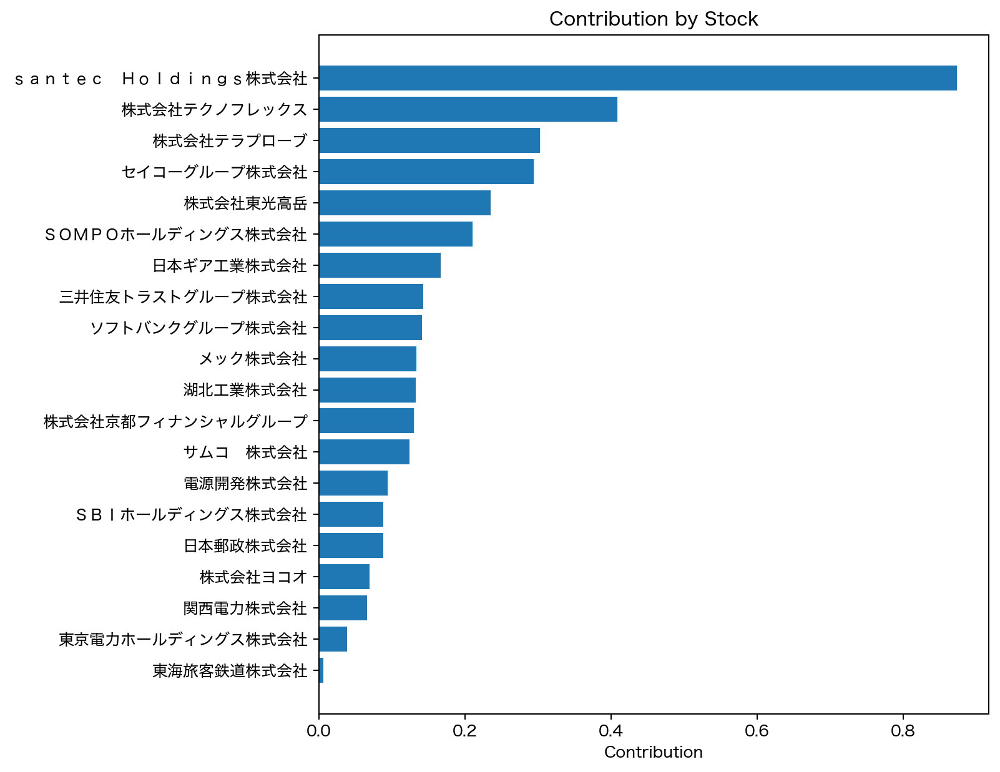
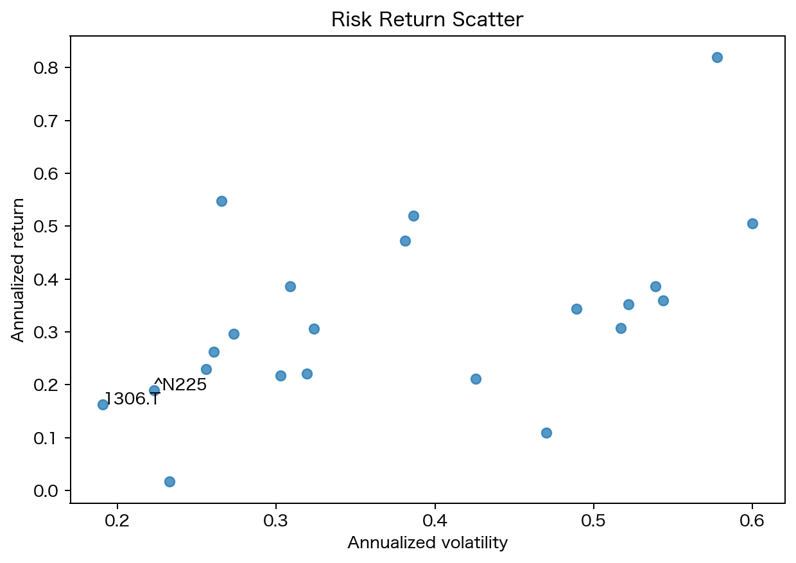

# BEYOND BUFFETT 分析レポート草案

## 1. 分析の位置づけ

本分析は、公開データを用いて東証上場企業をスクリーニングし、既存の競争優位、変革余地、Future Moat、バリュエーション規律を統合した BEYOND BUFFETT Score によって候補企業を選定したものである。

本資料は日経STOCKリーグ提出レポートの材料であり、個別銘柄の投資助言を目的としない。

## 2. スクリーニング結果

| 段階 | 社数 |
| --- | --- |
| 母集団 | 3649 |
| 株価取得可能 | 3648 |
| 流動性条件通過 | 2560 |
| 投資適格性通過 | 1917 |
| スコア算出対象 | 1917 |
| 統合スコア上位80社 | 80 |
| 最終20銘柄 | 20 |

### EDINET取得状況

EDINETから有価証券報告書候補を10712件取得し、取得可能なXBRL項目を財務指標に反映した。

## 3. スコア上位候補

| コード | Ticker | 企業名 | 業種 | カテゴリ | Adjusted BB Score |
| --- | --- | --- | --- | --- | --- |
| 9022 | 9022.T | 東海旅客鉄道株式会社 | Land Transportation | Transformation Moat | 1.0397238446401904 |
| 9501 | 9501.T | 東京電力ホールディングス株式会社 | Electric Power and Gas | Transformation Moat | 0.8868899270365259 |
| 8309 | 8309.T | 三井住友トラストグループ株式会社 | Banks | Core Moat | 0.8634534644882659 |
| 3449 | 3449.T | 株式会社テクノフレックス | Metal Products | Core Moat | 0.8494919596774049 |
| 8630 | 8630.T | ＳＯＭＰＯホールディングス株式会社 | Insurance | Core Moat | 0.8254492201750532 |
| 8473 | 8473.T | ＳＢＩホールディングス株式会社 | Securities and Commodities Futures | Transformation Moat | 0.8224475445696 |
| 6178 | 6178.T | 日本郵政株式会社 | Services | Core Moat | 0.7794163747984253 |
| 6777 | 6777.T | ｓａｎｔｅｃ　Ｈｏｌｄｉｎｇｓ株式会社 | Electric Appliances | Future Moat | 0.7686452854279032 |
| 5844 | 5844.T | 株式会社京都フィナンシャルグループ | Banks | Core Moat | 0.7616077583800178 |
| 6627 | 6627.T | 株式会社テラプローブ | Electric Appliances | Future Moat | 0.7493433520355965 |
| 6524 | 6524.T | 湖北工業株式会社 | Electric Appliances | Future Moat | 0.7491186038260512 |
| 6387 | 6387.T | サムコ　株式会社 | Machinery | Future Moat | 0.7072750147913675 |
| 6800 | 6800.T | 株式会社ヨコオ | Electric Appliances | Future Moat | 0.7004234832402013 |
| 9513 | 9513.T | 電源開発株式会社 | Electric Power and Gas | Transformation Moat | 0.6926902727173073 |
| 8050 | 8050.T | セイコーグループ株式会社 | Precision Instruments | Future Moat | 0.6784572489379831 |
| 9984 | 9984.T | ソフトバンクグループ株式会社 | Information & Communication | Core Moat | 0.660197539900852 |
| 6617 | 6617.T | 株式会社東光高岳 | Electric Appliances | Future Moat | 0.6578866726282621 |
| 6356 | 6356.T | 日本ギア工業株式会社 | Machinery | Future Moat | 0.6566912419648452 |
| 1909 | 1909.T | 日本ドライケミカル株式会社 | Machinery | Future Moat | 0.6566703113640656 |
| 4971 | 4971.T | メック株式会社 | Chemicals | Core Moat | 0.6421869729103602 |
| 6278 | 6278.T | ユニオンツール株式会社 | Machinery | Future Moat | 0.6418621881878204 |
| 9503 | 9503.T | 関西電力株式会社 | Electric Power and Gas | Transformation Moat | 0.635208023717019 |
| 6941 | 6941.T | 山一電機株式会社 | Electric Appliances | Future Moat | 0.6343907303498483 |
| 7186 | 7186.T | 株式会社コンコルディア・フィナンシャルグループ | Banks | Core Moat | 0.6253467158259132 |
| 6871 | 6871.T | 株式会社日本マイクロニクス | Electric Appliances | Future Moat | 0.6169476761311623 |
| 6264 | 6264.T | 株式会社マルマエ | Machinery | Future Moat | 0.6156610158996589 |
| 6920 | 6920.T | レーザーテック株式会社 | Electric Appliances | Future Moat | 0.6144637506863098 |
| 5985 | 5985.T | サンコール株式会社 | Metal Products | Transformation Moat | 0.6071755881056528 |
| 6648 | 6648.T | 株式会社かわでん | Electric Appliances | Future Moat | 0.6043488133806569 |
| 6327 | 6327.T | 北川精機株式会社 | Machinery | Future Moat | 0.604050225352687 |

## 4. 500万円ポートフォリオ

| コード | Ticker | 企業名 | 業種 | カテゴリ | 前営業日終値 | 株数 | 投資額 | 比率 |
| --- | --- | --- | --- | --- | --- | --- | --- | --- |
| 9022 | 9022.T | 東海旅客鉄道株式会社 | Land Transportation | Transformation Moat | 3386.0 | 114 | 386004.0 | 0.0772008 |
| 9501 | 9501.T | 東京電力ホールディングス株式会社 | Electric Power and Gas | Transformation Moat | 558.9000244140625 | 527 | 294540.31286621094 | 0.0589080625732421 |
| 8309 | 8309.T | 三井住友トラストグループ株式会社 | Banks | Core Moat | 5468.0 | 52 | 284336.0 | 0.0568672 |
| 3449 | 3449.T | 株式会社テクノフレックス | Metal Products | Core Moat | 6830.0 | 41 | 280030.0 | 0.056006 |
| 8630 | 8630.T | ＳＯＭＰＯホールディングス株式会社 | Insurance | Core Moat | 5906.0 | 46 | 271676.0 | 0.0543352 |
| 8473 | 8473.T | ＳＢＩホールディングス株式会社 | Securities and Commodities Futures | Transformation Moat | 2911.0 | 93 | 270723.0 | 0.0541446 |
| 6178 | 6178.T | 日本郵政株式会社 | Services | Core Moat | 2035.0 | 126 | 256410.0 | 0.051282 |
| 6777 | 6777.T | ｓａｎｔｅｃ　Ｈｏｌｄｉｎｇｓ株式会社 | Electric Appliances | Future Moat | 25380.0 | 10 | 253800.0 | 0.05076 |
| 5844 | 5844.T | 株式会社京都フィナンシャルグループ | Banks | Core Moat | 4341.0 | 57 | 247437.0 | 0.0494874 |
| 6627 | 6627.T | 株式会社テラプローブ | Electric Appliances | Future Moat | 11040.0 | 22 | 242880.0 | 0.048576 |
| 6524 | 6524.T | 湖北工業株式会社 | Electric Appliances | Future Moat | 6070.0 | 40 | 242800.0 | 0.04856 |
| 6387 | 6387.T | サムコ　株式会社 | Machinery | Future Moat | 11050.0 | 21 | 232050.0 | 0.04641 |
| 6800 | 6800.T | 株式会社ヨコオ | Electric Appliances | Future Moat | 5170.0 | 44 | 227480.0 | 0.045496 |
| 9513 | 9513.T | 電源開発株式会社 | Electric Power and Gas | Transformation Moat | 3954.0 | 57 | 225378.0 | 0.0450756 |
| 8050 | 8050.T | セイコーグループ株式会社 | Precision Instruments | Future Moat | 7420.0 | 30 | 222600.0 | 0.04452 |
| 6356 | 6356.T | 日本ギア工業株式会社 | Machinery | Future Moat | 1492.0 | 145 | 216340.0 | 0.043268 |
| 9984 | 9984.T | ソフトバンクグループ株式会社 | Information & Communication | Core Moat | 8541.0 | 25 | 213525.0 | 0.042705 |
| 6617 | 6617.T | 株式会社東光高岳 | Electric Appliances | Future Moat | 8180.0 | 26 | 212680.0 | 0.042536 |
| 4971 | 4971.T | メック株式会社 | Chemicals | Core Moat | 11100.0 | 19 | 210900.0 | 0.04218 |
| 9503 | 9503.T | 関西電力株式会社 | Electric Power and Gas | Transformation Moat | 2288.5 | 91 | 208253.5 | 0.0416507 |

## 5. バックテスト・リスク分析

| name | observations | cumulative_return | annualized_return | annualized_volatility | sharpe_ratio | max_drawdown | capm_alpha | capm_beta | information_ratio |
| --- | --- | --- | --- | --- | --- | --- | --- | --- | --- |
| Portfolio | 1222 | 4.012420963068697 | 0.3943227774607711 | 0.2290426055518083 | 1.721613219124759 | -0.3327626551728064 | 0.1745116601643583 | 1.0601302014581433 | 1.7057211559301784 |
| 1306.T | 1219 | 1.0755998776678974 | 0.1629528226277661 | 0.1907729411637874 | 0.8541715697922987 | -0.2329632869444462 |  |  |  |
| ^N225 | 1221 | 1.3229519915417507 | 0.1899984272963761 | 0.2230552624976821 | 0.8517997969151277 | -0.2625860724822559 |  |  |  |

## 6. データ上の限界

本分析では、無料・公開データを中心に用いたため、一部の財務指標やガバナンス指標については欠損や基準日の差異が存在する。そのため、一次スクリーニングでは取得可能な定量指標を用い、最終選定段階では各社の有価証券報告書、決算説明資料、中期経営計画を確認することで、データ上の限界を補完する必要がある。また、バックテストは現在上場している企業を対象としているため、上場廃止企業を含まない生存者バイアスが存在する可能性がある。
